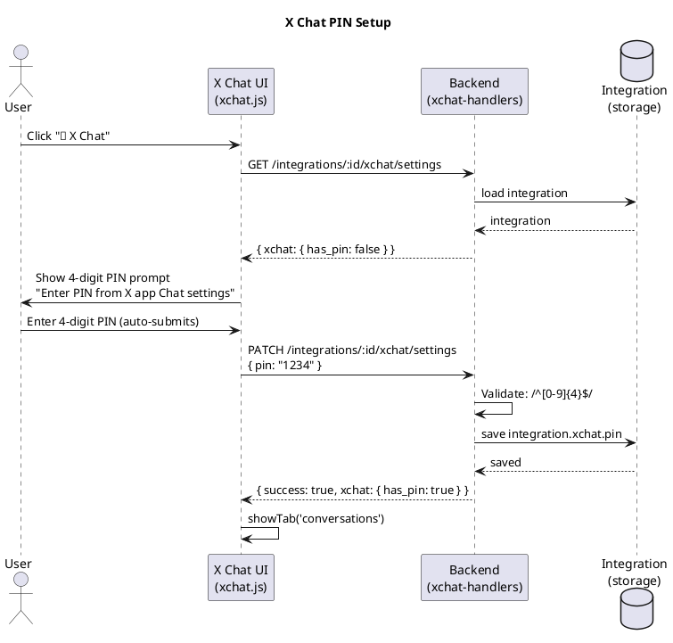
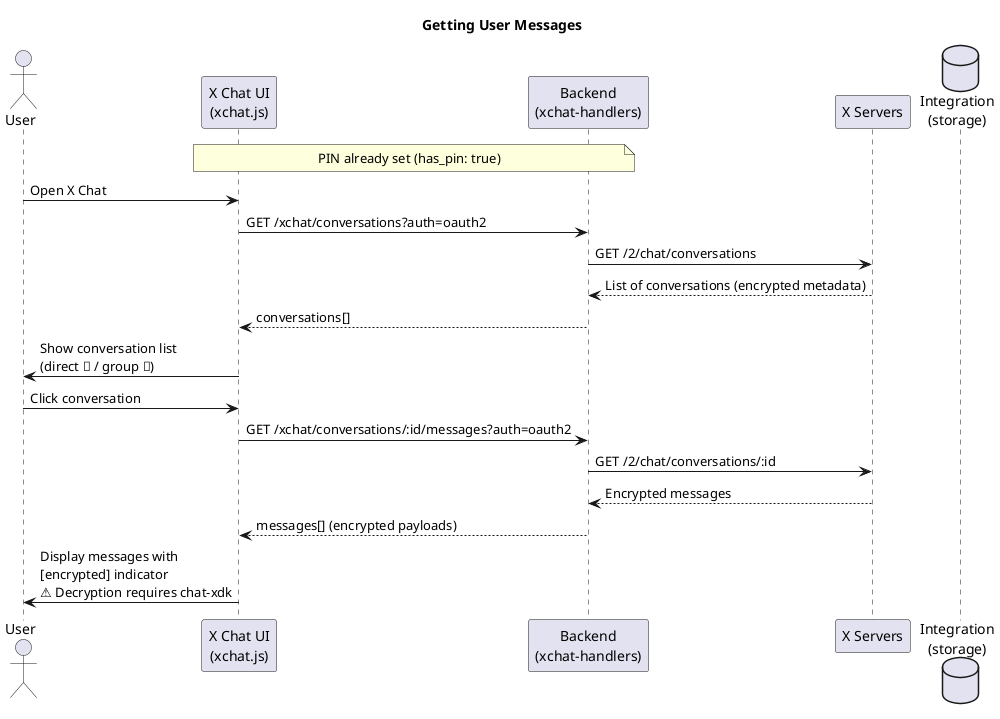
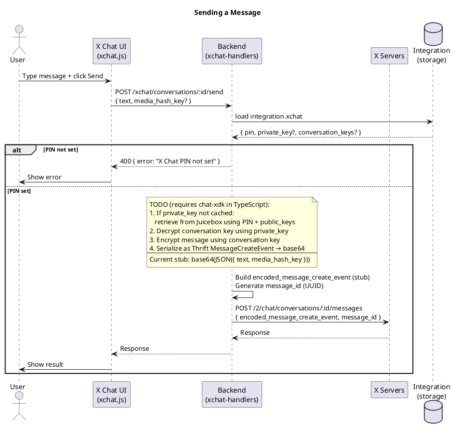
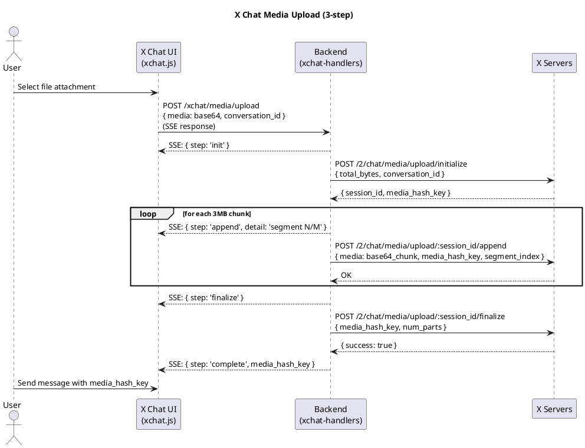
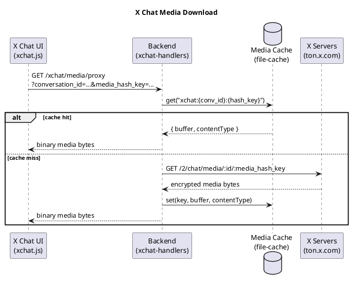
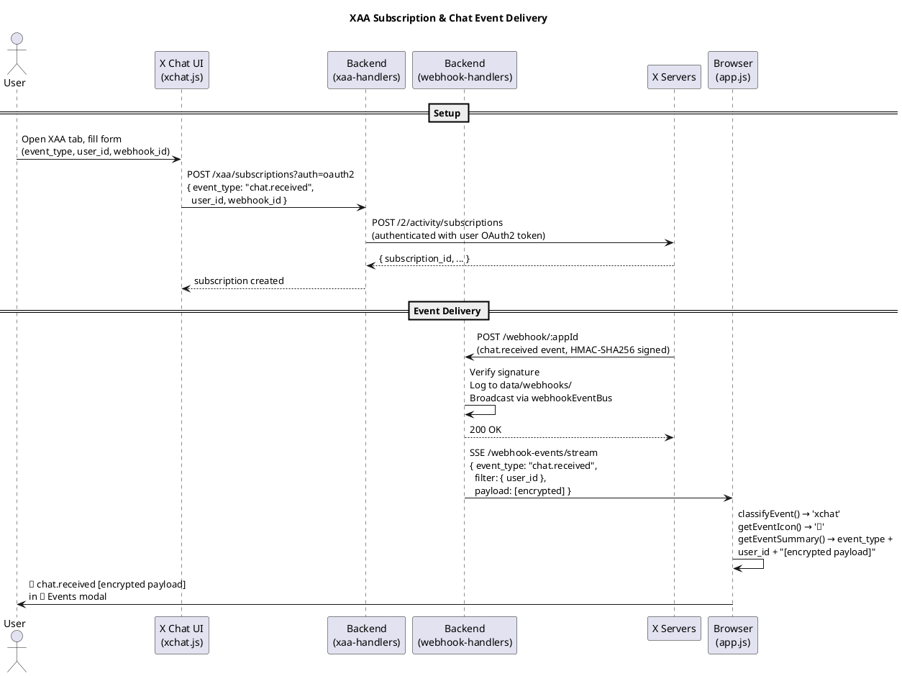

# X Chat Feature — Requirements, Design & Tasks

> Reference: [XChat Migration Guide](./XCHAT-MIGRATION-GUIDE.md) | [XChat PDF](../XChat_Beta_Enterprise_User_Migration_Guide_v1.pdf)

## Requirements

### Functional Requirements

1. **Chat Mode Selection** — When user clicks "💬 Chat", choose between Legacy DM or X Chat.

2. **X Chat: PIN Management** — User provides their 4-digit numeric PIN (set in the X app). Stored on the integration. Used to retrieve the private key from Juicebox. Required before any chat operation.

3. **X Chat: List Conversations** — `GET /2/chat/conversations`

4. **X Chat: View Messages** — `GET /2/chat/conversations/{id}` (paginated, encrypted payloads displayed raw — decryption requires chat-xdk, Rust/Python only)

5. **X Chat: Send Messages** — `POST /2/chat/conversations/{id}/messages`. Best-effort: base64-encoded plaintext JSON as `encoded_message_create_event` (real flow requires chat-xdk encryption).

6. **X Chat: Upload Media** — 3-step: initialize → append (chunked) → finalize → `media_hash_key`

7. **X Chat: Download Media** — `GET /2/chat/media/{id}/{media_hash_key}` or TON URL `https://ton.x.com/1.1/ton/data/xchat_media/{conversation_id}/{media_hash_key}`

8. **X Chat: Get User Public Keys** — `GET /2/users/{id}/public_keys`

9. **X Chat: Real-time Events (XAA)** — Subscribe to `chat.received` / `chat.sent` via `POST /2/activity/subscriptions` with `webhook_id`. Events arrive as webhook POSTs to the existing receiver, logged and broadcast via the same `webhookEventBus`, displayed in the "📨 Events" modal with a 🔐 icon.

### Non-Functional Requirements

- X Chat requires **OAuth2** only.
- XAA create/list: BearerToken, OAuth2, or OAuth1. XAA delete: BearerToken only.
- PIN is 4 digits, stored on integration. Private key and conversation keys cached on integration. Never returned in API responses — only presence reported.
- Legacy DM flow and Account Activity webhooks remain fully functional.

---

## Design

### Key Storage Model

```
Integration.xchat {
  pin: string                          // 4-digit, set by user in X app
  private_key?: string                 // cached from Juicebox (expensive to retrieve)
  public_key_version?: string          // to detect key rotation
  conversation_keys?: Record<id, key>  // decrypted symmetric keys per conversation
}
```

Private key and conversation keys are never returned in API responses — only `has_pin`, `has_private_key`, `conversation_key_count` are exposed.

### Similarities: Legacy DM vs X Chat

| Aspect | Legacy DM | X Chat |
|--------|-----------|--------|
| Auth | OAuth1 or OAuth2 | OAuth2 only |
| List conversations | followers list | `GET /2/chat/conversations` |
| Get messages | `GET /2/dm_events` by participant | `GET /2/chat/conversations/{id}` (encrypted) |
| Send message | `POST /2/dm_conversations/.../messages` | `POST /2/chat/conversations/{id}/messages` (encrypted) |
| Media upload | INIT/APPEND/FINALIZE → `media_id` | initialize/append/finalize → `media_hash_key` |
| Media download | TON URL via `dmConversationsMediaDownload` | `GET /2/chat/media/{id}/{media_hash_key}` |
| Real-time events | Account Activity API (webhooks) | X Activity API — XAA (webhooks or stream) |

### Architecture

```
oauth-demo/
├── handlers/
│   ├── handler-utils.ts        resolveAuth(), sseResponse(), shared mediaCache  [DONE]
│   ├── dm-handlers.ts          legacy DM — refactored to use handler-utils      [DONE]
│   ├── media-handlers.ts       legacy media — refactored to use handler-utils   [DONE]
│   ├── xchat-handlers.ts       X Chat conversations/messages/media/settings     [DONE]
│   └── xaa-handlers.ts         XAA subscription management                      [DONE]
├── public/
│   ├── app.js                  chat mode selection, xchat event classification  [DONE]
│   ├── xchat.js                X Chat UI: PIN, conversations, messages, XAA     [DONE]
│   └── style.css               X Chat styles                                    [DONE]
├── oauth-demo.ts               all new routes registered                        [DONE]
└── types.ts                    Integration.xchat field                          [DONE]
```

### New Backend Routes

| Method | Route | Handler | Description |
|--------|-------|---------|-------------|
| GET | `/integrations/:id/xchat/settings` | `getXChatSettings` | Get xchat config (presence only, no secrets) |
| PATCH | `/integrations/:id/xchat/settings` | `updateXChatSettings` | Save PIN / private key / conversation keys |
| GET | `/integrations/:id/xchat/conversations` | `getXChatConversations` | List chat conversations |
| GET | `/integrations/:id/xchat/conversations/:conversationId/messages` | `getXChatMessages` | Get messages |
| POST | `/integrations/:id/xchat/conversations/:conversationId/send` | `sendXChatMessage` | Send message |
| POST | `/integrations/:id/xchat/media/upload` | `uploadXChatMedia` | 3-step upload (SSE progress) |
| GET | `/integrations/:id/xchat/media/proxy` | `proxyXChatMedia` | Download/proxy xchat media |
| GET | `/integrations/:id/xchat/users/:userId/public-keys` | `getUserPublicKeys` | Get user public keys |
| GET | `/integrations/:id/xaa/subscriptions` | `getXAASubscriptions` | List XAA subscriptions |
| POST | `/integrations/:id/xaa/subscriptions` | `createXAASubscription` | Create chat event subscription |
| DELETE | `/integrations/:id/xaa/subscriptions/:subscriptionId` | `deleteXAASubscription` | Delete subscription |

---

## Implemented Flows

### PIN Setup Flow



### Getting User Messages Flow



### Sending a Message Flow



The backend gates on PIN presence — if no PIN is stored, the request is rejected before reaching the API. The `state.pin` in the frontend is retained for the future real encryption path (when chat-xdk TypeScript bindings become available).

### Media Upload Flow



### Media Download / Proxy Flow



### XAA Subscription + Webhook Event Flow



---

## Task Status

| Task | Description | Status |
|------|-------------|--------|
| 1 | Extract shared handler utilities (`handler-utils.ts`) | ✅ Done |
| 2 | X Chat backend handlers (`xchat-handlers.ts`) | ✅ Done |
| 3 | Register new routes in `oauth-demo.ts` | ✅ Done |
| 4 | Frontend chat mode selection (`app.js`) | ✅ Done |
| 5 | X Chat UI (`xchat.js`, `index.html`, `style.css`) | ✅ Done |
| 6 | Media attachment flow (upload + download) | ✅ Done |
| 7 | XAA backend handlers (`xaa-handlers.ts`) | ✅ Done |
| 8 | XAA frontend (subscription management + event display) | ✅ Done |
| — | PIN management + key caching on integration | ✅ Done |
