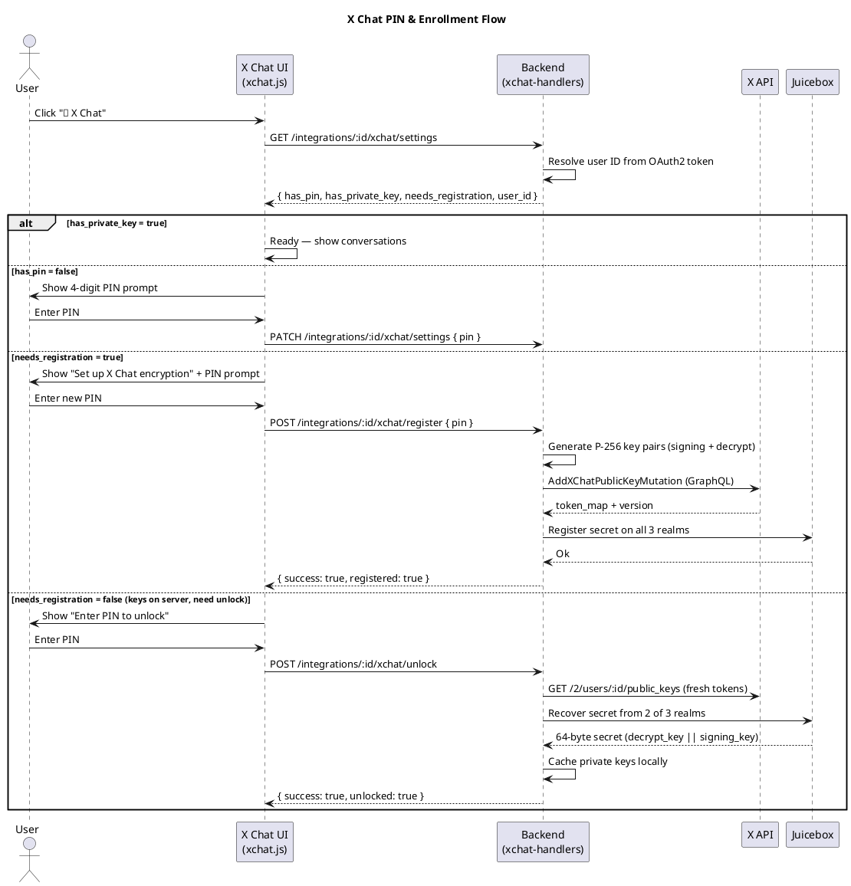
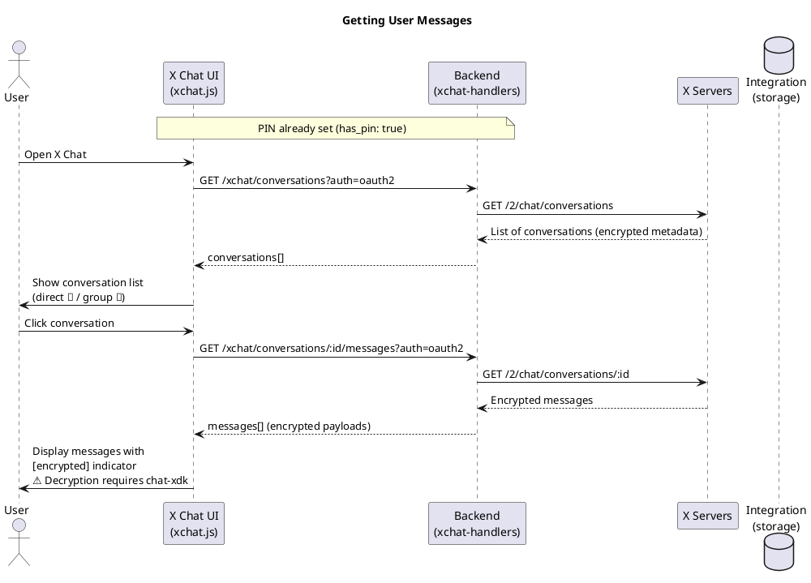
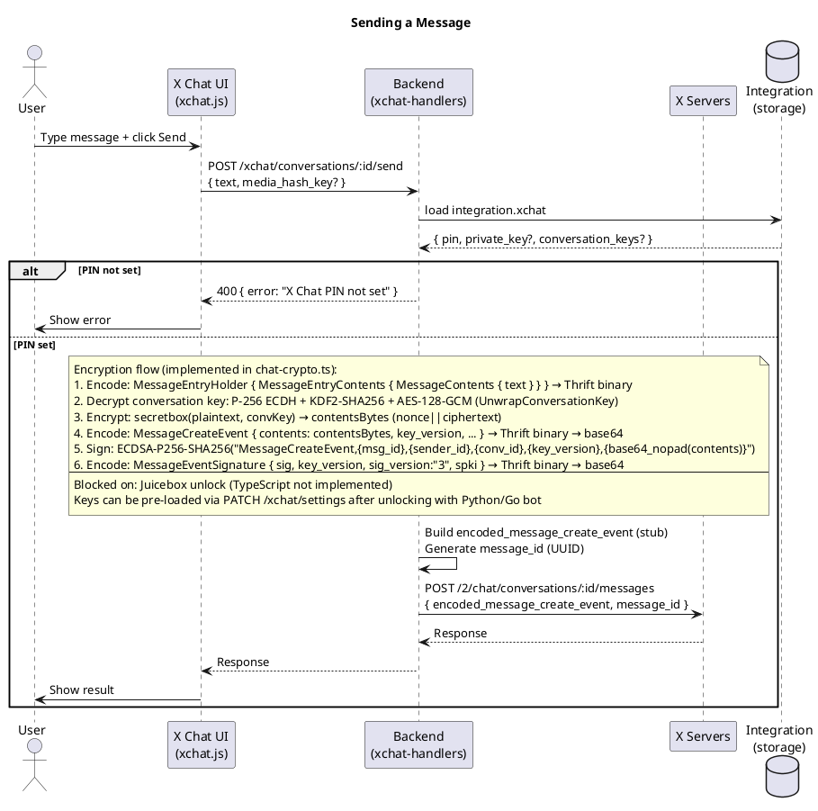
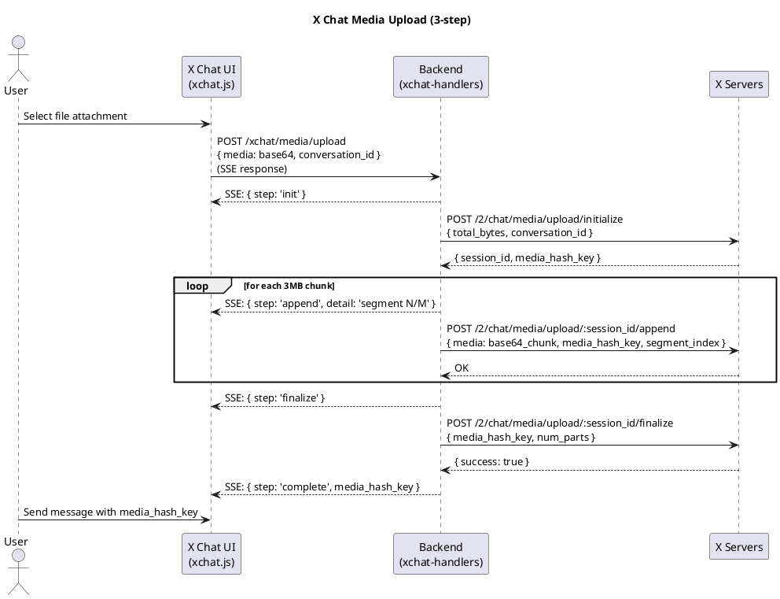
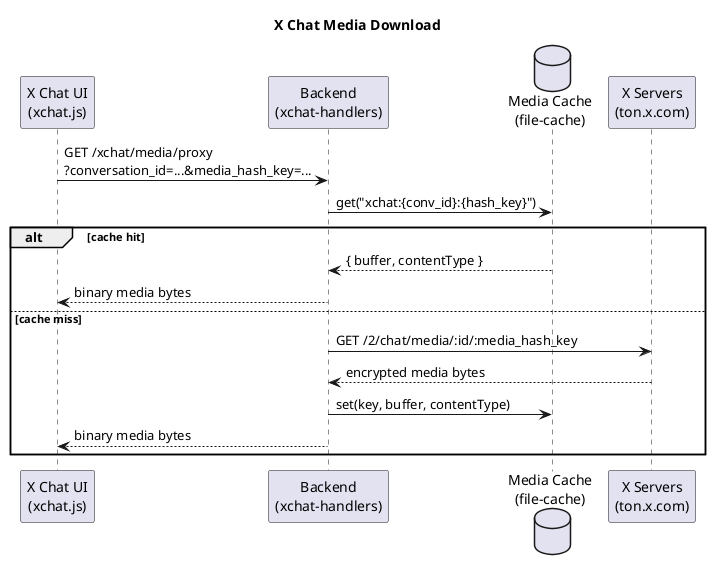
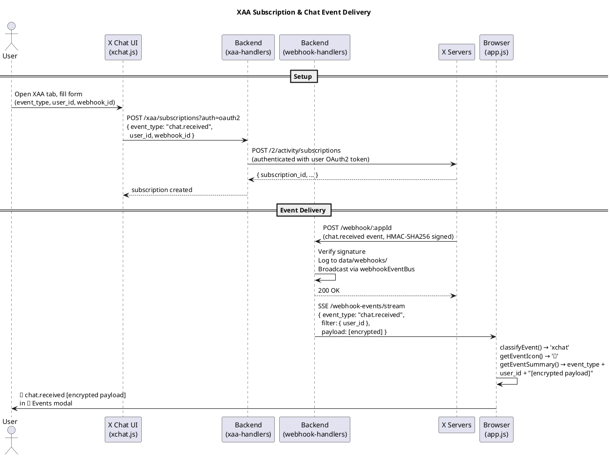

# X Chat Feature — Requirements, Design & Tasks

> Reference: [XChat Migration Guide](XCHAT-MIGRATION-GUIDE.md) | [XChat PDF](../../XChat_Beta_Enterprise_User_Migration_Guide_v1.pdf)

## Requirements

### Functional Requirements

1. **Chat Mode Selection** — When user clicks "💬 Chat", choose between Legacy DM or X Chat.

2. **X Chat: PIN Management** — User provides their 4-digit numeric PIN (set in the X app). Stored on the integration. Used to retrieve the private key from Juicebox. Required before any chat operation.

3. **X Chat: List Conversations** — `GET /2/chat/conversations`

4. **X Chat: View Messages** — `GET /2/chat/conversations/{id}` (paginated, encrypted payloads displayed raw — decryption requires chat-xdk, Rust/Python only)

5. **X Chat: Send Messages** — `POST /2/chat/conversations/{id}/messages`. Best-effort: base64-encoded plaintext JSON as `encoded_message_create_event` (real flow requires chat-xdk encryption).

6. **X Chat: Upload Media** — 3-step: initialize → append (chunked) → finalize → `media_hash_key`

7. **X Chat: Download Media** — `GET /2/chat/media/{id}/{media_hash_key}` or TON URL `https://ton.x.com/1.1/ton/data/xchat_media/{conversation_id}/{media_hash_key}`

8. **X Chat: Get User Public Keys** — `GET /2/users/{id}/public_keys`

9. **X Chat: Real-time Events (XAA)** — Subscribe to `chat.received` / `chat.sent` via `POST /2/activity/subscriptions` with `webhook_id`. Events arrive as webhook POSTs to the existing receiver, logged and broadcast via the same `webhookEventBus`, displayed in the "📨 Events" modal with a 🔐 icon.

### Non-Functional Requirements

- X Chat requires **OAuth2** only.
- XAA create/list: BearerToken, OAuth2, or OAuth1. XAA delete: BearerToken only.
- PIN is 4 digits, stored on integration. Private key and conversation keys cached on integration. Never returned in API responses — only presence reported.
- Legacy DM flow and Account Activity webhooks remain fully functional.

### Encryption Stack

Verified against the Go reference implementation at `/Users/dcherkas/projects/opensource/twitter` (mautrix-twitter), specifically `pkg/twittermeow/crypto/` and `pkg/juiceboxgo/`.

| Layer | Detail |
|-------|--------|
| Key types | Two separate **P-256 ECDSA** keys per user: `SigningKey` (sign messages) + `DecryptKey` (unwrap conversation keys). Both stored as base64-encoded 32-byte raw private scalars |
| Key custody | Juicebox — PIN-based threshold secret sharing (OPRF protocol). Full Go implementation in `pkg/juiceboxgo/`. Not yet implemented in TypeScript |
| Conversation key wrapping | **P-256 ECDH + KDF2-SHA256 + AES-128-GCM**. Blob: `ephPub(65 uncompressed) \| AES-GCM(ct+tag)`. KDF: `SHA256(shared \| counter_BE32 \| ephPub)` → first 16 = AES key, last 16 = IV. Result is a 32-byte secretbox key |
| Message encryption | **XSalsa20-Poly1305 (libsodium secretbox)**. Layout: `nonce(24) \| ciphertext+mac`. Key: decrypted 32-byte conversation key |
| Plaintext wire format | `MessageEntryHolder { contents: MessageEntryContents { message: MessageContents { text } } }` → Thrift binary → secretbox encrypted → `MessageCreateEvent.contents` (bytes field, thrift id 100) → Thrift binary → base64 → `encoded_message_create_event` |
| Message signing | **ECDSA P-256 SHA-256**. Preimage: `"MessageCreateEvent,{msg_id},{sender_id},{conv_id},{key_version},{base64_nopad(contents_bytes)}"`. Signature: raw `r(32)\|\|s(32)` → base64 with padding. `MessageEventSignature` thrift → base64 → `encoded_message_event_signature`. Signature version: `"3"` |
| Conversation token | Server-provided opaque token per conversation, extracted from incoming `MessageEvent.conversation_token`. Required for sending. Stored in `ConversationKeyStorage` |

**Previously incorrect assumptions** (from xchat-bot-python/Go API surface only):
- ~~X25519 + Ed25519~~ → actually P-256 ECDSA (two separate keys)
- ~~AES-256-GCM message encryption~~ → actually XSalsa20-Poly1305 secretbox
- ~~X25519 + HKDF + AES-256-GCM key wrapping~~ → actually P-256 ECDH + KDF2-SHA256 + AES-128-GCM
- ~~Flat MessageCreateEvent thrift~~ → actually nested MessageEntryHolder wrapper

### Key Storage Model

```
data/user-xchat/{userId}.json
  pin: string                    // 4-digit, set by user in X app
  private_key?: string           // NOT USED — replaced by signingKeyB64 + decryptKeyB64
  signing_key_version?: string   // key version from GET /2/users/{id}/public_keys

data/user-public-keys/{userId}.json
  public_key: string             // P-256 public key (SPKI base64) — for encrypting conv keys to this user
  signing_public_key: string     // P-256 signing public key (SPKI base64) — for verifying signatures
  version: string                // key version
  juicebox_config: object        // Juicebox realm config for PIN-based key recovery

data/conversation-keys/{conversationId}.json
  encrypted_conversation_key: string  // wrapped 32-byte secretbox key (from KeyChange event)
  key_version: string
  conversation_token?: string         // server-provided token required for sending
```

No xchat data is stored on the integration. All xchat data is user-scoped or conversation-scoped.

### Similarities: Legacy DM vs X Chat

| Aspect | Legacy DM | X Chat |
|--------|-----------|--------|
| Auth | OAuth1 or OAuth2 | OAuth2 only |
| List conversations | followers list | `GET /2/chat/conversations` |
| Get messages | `GET /2/dm_events` by participant | `GET /2/chat/conversations/{id}` (encrypted) |
| Send message | `POST /2/dm_conversations/.../messages` | `POST /2/chat/conversations/{id}/messages` (encrypted) |
| Media upload | INIT/APPEND/FINALIZE → `media_id` | initialize/append/finalize → `media_hash_key` |
| Media download | TON URL via `dmConversationsMediaDownload` | `GET /2/chat/media/{id}/{media_hash_key}` |
| Real-time events | Account Activity API (webhooks) | X Activity API — XAA (webhooks or stream) |

### Architecture

```
oauth-demo/
├── handlers/
│   ├── handler-utils.ts        resolveAuth(), sseResponse(), shared mediaCache  [DONE]
│   ├── dm-handlers.ts          legacy DM — refactored to use handler-utils      [DONE]
│   ├── media-handlers.ts       legacy media — refactored to use handler-utils   [DONE]
│   ├── xchat-handlers.ts       X Chat conversations/messages/media/settings     [DONE]
│   └── xaa-handlers.ts         XAA subscription management                      [DONE]
├── public/
│   ├── app.js                  chat mode selection, xchat event classification  [DONE]
│   ├── xchat.js                X Chat UI: PIN, conversations, messages, XAA     [DONE]
│   └── style.css               X Chat styles                                    [DONE]
├── oauth-demo.ts               all new routes registered                        [DONE]
└── types.ts                    Integration.xchat field                          [DONE]
```

### New Backend Routes

| Method | Route | Handler | Description |
|--------|-------|---------|-------------|
| GET | `/integrations/:id/xchat/settings` | `getXChatSettings` | Get xchat config (presence only, no secrets) |
| PATCH | `/integrations/:id/xchat/settings` | `updateXChatSettings` | Save PIN / private key / conversation keys |
| GET | `/integrations/:id/xchat/conversations` | `getXChatConversations` | List chat conversations |
| GET | `/integrations/:id/xchat/conversations/:conversationId/messages` | `getXChatMessages` | Get messages |
| POST | `/integrations/:id/xchat/conversations/:conversationId/send` | `sendXChatMessage` | Send message |
| POST | `/integrations/:id/xchat/media/upload` | `uploadXChatMedia` | 3-step upload (SSE progress) |
| GET | `/integrations/:id/xchat/media/proxy` | `proxyXChatMedia` | Download/proxy xchat media |
| GET | `/integrations/:id/xchat/users/:userId/public-keys` | `getUserPublicKeys` | Get user public keys |
| GET | `/integrations/:id/xaa/subscriptions` | `getXAASubscriptions` | List XAA subscriptions |
| POST | `/integrations/:id/xaa/subscriptions` | `createXAASubscription` | Create chat event subscription |
| DELETE | `/integrations/:id/xaa/subscriptions/:subscriptionId` | `deleteXAASubscription` | Delete subscription |

---

## Implemented Flows

### PIN Setup Flow



#### Enrollment Detection Logic

The `getXChatSettings` handler determines the user's state:

```typescript
// 1. Check local cache
const xchat = await userXChatStorage.load(userId);
if (xchat?.private_key) return { has_private_key: true, needs_registration: false };

// 2. Check server for published keys
const pkResponse = await client.users.getUsersPublicKey(userId);
const hasPublicKeys = !!pkResponse?.data?.public_key;

return {
  has_private_key: false,
  has_pin: !!xchat?.pin,
  needs_registration: !hasPublicKeys,
};
```

### Getting User Messages Flow



### Sending a Message Flow



The backend gates on PIN presence — if no PIN is stored, the request is rejected before reaching the API. The `state.pin` in the frontend is retained for the future real encryption path (when chat-xdk TypeScript bindings become available).

### Media Upload Flow



### Media Download / Proxy Flow



### XAA Subscription + Webhook Event Flow



---

## Task Status

| Task | Description | Status |
|------|-------------|--------|
| 1 | Extract shared handler utilities (`handler-utils.ts`) | ✅ Done |
| 2 | X Chat backend handlers (`xchat-handlers.ts`) | ✅ Done |
| 3 | Register new routes in `oauth-demo.ts` | ✅ Done |
| 4 | Frontend chat mode selection (`app.js`) | ✅ Done |
| 5 | X Chat UI (`xchat.js`, `index.html`, `style.css`) | ✅ Done |
| 6 | Media attachment flow (upload + download) | ✅ Done |
| 7 | XAA backend handlers (`xaa-handlers.ts`) | ✅ Done |
| 8 | XAA frontend (subscription management + event display) | ✅ Done |
| 9 | PIN management + key unlock flow | ✅ Done |
| 10 | Separate user/conversation key storage from integration | ✅ Done |
| 11 | Correct encryption stack (P-256, secretbox, KDF2) | ✅ Done |
| 12 | Juicebox key recovery (PIN → private keys) | ✅ Done |
| 13 | Juicebox key registration (generate + store keys) | ✅ Done |
| 14 | Message history from API (`GET /events`) | ✅ Done |
| 15 | Reactions, edits, reply previews | ✅ Done |
| 16 | User lookup + avatars in UI | ✅ Done |
| 17 | Signature version "7" (Go bridge fix) | ✅ Done |
| — | Enrollment detection + registration UI flow | 🔲 Next |
| — | Media download (API returns 403) | ❌ Blocked — requires whitelisting from X |
| — | New conversation key exchange (API returns 404) | ❌ Blocked — endpoint not implemented |

---

## Juicebox TypeScript Port

### Crypto Primitives Required

| Primitive | Used In | Purpose | TypeScript Library |
|-----------|---------|---------|-------------------|
| **Ristretto255** (scalar/point arithmetic) | OPRF, Shamir secret sharing | Blinding, evaluation, Lagrange interpolation | `@noble/curves` (ristretto255 via ed25519 module) |
| **Argon2id** | PIN hashing | Derive `access_key` (32B) + `encryption_key_seed` (32B) from PIN | `hash-wasm` or `@noble/hashes/argon2` |
| **SHA-512** | OPRF finalization, unlock key derivation | Hash OPRF output to 64 bytes | Node.js `crypto` built-in |
| **Blake2s-256** | Noise protocol, encryption key derivation | MAC for key derivation, Noise hash function | `@noble/hashes` (blake2s) |
| **Blake2s-128** (keyed MAC) | Unlock key tag, secret commitment | Realm-specific tags and commitments | `@noble/hashes` (blake2s) |
| **ChaCha20-Poly1305** | Noise transport, secret encryption | Noise cipher, decrypt recovered secret | `@noble/ciphers` (chacha20poly1305) |
| **X25519** | Noise NK handshake | Ephemeral DH with realm static key | `@noble/curves` (x25519) |
| **Ed25519** | OPRF signature verification | Verify realm's OPRF public key signature | `@noble/curves` (ed25519) |
| **HKDF-Blake2s** | Noise key derivation | `mix_key` and `split` operations | `@noble/hashes` (hkdf + blake2s) |
| **CBOR** | Realm request/response serialization | Encode/decode Juicebox protocol messages | `cbor-x` or `cborg` |

### Protocol Overview

The Juicebox recovery protocol has 3 phases, each involving parallel requests to multiple realms:

```
Phase 1: Query version
  → Each realm returns its stored RegistrationVersion
  → Client picks version with threshold agreement

Phase 2: OPRF evaluation
  → Client: hash PIN with Argon2id → access_key
  → Client: blind access_key with random scalar → blinded_input
  → Each realm: evaluate OPRF on blinded_input → blinded_result_share + DLEQ proof
  → Client: verify DLEQ proofs, combine shares via Lagrange interpolation
  → Client: finalize OPRF → derive unlock_key, verify commitment

Phase 3: Retrieve encrypted secret
  → Client: derive unlock_key_tag per realm
  → Each realm: verify tag, return encrypted_secret + encryption_key_scalar_share
  → Client: combine scalar shares via Lagrange interpolation
  → Client: derive encryption_key from seed + combined scalar
  → Client: decrypt secret with ChaCha20-Poly1305
```

The recovered secret is the raw P-256 private key material (signing + decrypt keys).

### Implementation Plan

| # | Task | Files | Est. Lines | Dependencies |
|---|------|-------|-----------|-------------|
| 1 | **PIN hashing** — Argon2id with salt construction | `juicebox/pin.ts` | ~40 | `hash-wasm` |
| 2 | **OPRF** — Start (blind), Finalize (unblind), DLEQ verify | `juicebox/oprf.ts` | ~100 | `@noble/curves` (ristretto255) |
| 3 | **Shamir secret sharing** — Lagrange interpolation for scalars and points | `juicebox/shamir.ts` | ~80 | `@noble/curves` (ristretto255) |
| 4 | **Crypto utilities** — DeriveUnlockKey, DeriveEncryptionKey, DecryptSecret, tags/commitments | `juicebox/crypto.ts` | ~80 | `@noble/hashes` (blake2s), `@noble/ciphers` (chacha20) |
| 5 | **Noise NK handshake** — Start, Finish, Transport encrypt/decrypt | `juicebox/noise.ts` | ~120 | `@noble/curves` (x25519), `@noble/hashes` (blake2s, hkdf), `@noble/ciphers` (chacha20) |
| 6 | **Realm client** — HTTP communication (software + hardware realms), CBOR serialization | `juicebox/realm.ts` | ~150 | `cbor-x`, noise.ts |
| 7 | **Configuration** — Parse and validate Juicebox config from public_keys response | `juicebox/config.ts` | ~60 | — |
| 8 | **Client** — Orchestrate 3-phase recovery with parallel realm requests | `juicebox/client.ts` | ~200 | All above |
| 9 | **Integration** — Wire into `unlockKeys` handler, store recovered keys | `handlers/xchat-handlers.ts` | ~30 | client.ts |

**Total estimated: ~860 lines of TypeScript**

### Dependencies to Install

```bash
cd oauth-demo
npm install @noble/curves @noble/hashes @noble/ciphers hash-wasm cbor-x
```

(`@noble/curves` and `@noble/hashes` may already be installed from the previous chat-crypto.ts)


## Juicebox Key Registration (Not Yet Implemented)

### Overview

Key registration is the process of generating new P-256 key pairs and storing the private key material in Juicebox realms, protected by the user's PIN. This is required for:
- Setting up encryption for a new X Chat user
- Changing/resetting a PIN
- Rotating keys

Currently only key **recovery** is implemented. Registration requires the inverse flow.

### Registration Flow (from HAR capture)

```
1. Client generates P-256 key pairs (signing + decrypt)
2. Client calls AddXChatPublicKeyMutation (GraphQL)
3. Server returns Juicebox token_map with fresh auth tokens
4. Client registers secret with all 3 Juicebox realms
5. Keys are now recoverable with PIN
```

### Step 1: Generate Key Pairs

```typescript
// Generate two P-256 ECDSA key pairs
const decryptKey = crypto.createECDH('prime256v1').generateKeys();
const signingKey = crypto.createECDH('prime256v1').generateKeys();

// The 64-byte secret to store in Juicebox:
// bytes[0:32] = decrypt key private scalar
// bytes[32:64] = signing key private scalar
const secret = Buffer.concat([decryptKey.getPrivateKey(), signingKey.getPrivateKey()]);
```

### Step 2: AddXChatPublicKeyMutation

```graphql
mutation AddXChatPublicKeyMutation($variables: String!) {
  user_add_public_key(variables: $variables) {
    __typename
    token_map { ... }
    version
  }
}
```

Variables (JSON-encoded string):
```json
{
  "version": "<timestamp_ms>",
  "generate_version": true,
  "public_key": {
    "public_key": "<SPKI base64 of decrypt key>",
    "signing_public_key": "<SPKI base64 of signing key>",
    "identity_public_key_signature": "<base64 signature>",
    "registration_method": "CustomPin"
  }
}
```

Response includes `token_map` with auth tokens for all 3 realms (same format as recovery).

### Step 3: Register with Juicebox Realms

All 3 realms must be registered (`register_threshold: 3`).

#### Software Realm (realm-b.x.com)

Direct CBOR over HTTP (no Noise handshake):

**Phase 1:**
- Request: CBOR string `"Register1"`
- Response: `{"Register1": "Ok"}`

**Phase 2:**
- Request: CBOR `"Register2"` with struct:
  ```
  {
    version: <realm_state_version>,
    oprf_private_key: <32 bytes>,
    oprf_signed_public_key: {
      public_key: <32 bytes>,
      verifying_key: <32 bytes>
    },
    unlock_key_commitment: <32 bytes>,
    unlock_key_tag: <16 bytes>,
    encryption_key_scalar_share: <32 bytes>,
    encrypted_secret: <encrypted>,
    encrypted_secret_commitment: <32 bytes>,
    num_guesses: <max_guess_count>,
    policy: { num_guesses: <max_guess_count> }
  }
  ```
- Response: `{"Register2": "Ok"}`

#### Hardware Realms (realm-east1.x.com, realm-west1.x.com)

Noise NK handshake + Transport (same as recovery):

**Phase 1:** Noise NK handshake with `Register1` piggybacked
**Phase 2:** Transport-encrypted `Register2` payload (same struct as software realm)

### Crypto Operations for Registration

1. **Argon2id** the PIN (same as recovery: `Standard2019` mode)
2. **OPRF key generation**: Generate random Ristretto255 scalar as `oprf_private_key`, derive `public_key` = scalar × basepoint
3. **Shamir secret sharing**: Split the 64-byte secret into 3 shares (one per realm)
4. **Encryption**: For each realm, derive `unlock_key` from OPRF output, encrypt the secret share
5. **Commitments**: Compute commitment hashes for verification

### Implementation Plan

| Step | Description | File | Dependencies |
|------|-------------|------|--------------|
| 1 | Add `register()` to Juicebox client | `juicebox/client.ts` | All existing modules |
| 2 | Add OPRF key generation (inverse of blind/finalize) | `juicebox/oprf.ts` | @noble/curves |
| 3 | Add Shamir secret splitting (inverse of interpolation) | `juicebox/shamir.ts` | @noble/curves |
| 4 | Add encryption (inverse of decryption in crypto.ts) | `juicebox/crypto.ts` | @noble/hashes, @noble/ciphers |
| 5 | Add `Register1`/`Register2` CBOR serialization | `juicebox/realm.ts` | cbor-x |
| 6 | Add `AddXChatPublicKeyMutation` GraphQL call | `handlers/xchat-handlers.ts` | — |
| 7 | Wire into UI (generate keys + register flow) | `public/xchat.js` | — |


## File/Directory Layout

All X Chat code lives in `oauth-demo/` (not a dedicated `xchat/` subdirectory):

| File | Purpose |
|------|---------|
| `chat-crypto.ts` | Encryption, key wrapping, secretbox, ECDSA signing, `encryptMessage()` |
| `chat-thrift.ts` | Thrift encode/decode wrappers using generic codec + schemas |
| `thrift-codec.ts` | Generic Thrift binary protocol encoder/decoder |
| `thrift-models.ts` | Auto-generated 106 schema definitions from Go structs |
| `xchat-utils.ts` | Conversation ID normalization (`toCanonicalConvId`, `toApiConvId`, `extractRecipientId`) |
| `handlers/xchat-handlers.ts` | All X Chat REST handlers (conversations, messages, send, settings, unlock) |
| `handlers/webhook-handlers.ts` | Webhook ingestion + automatic xchat decryption |
| `juicebox/` | Full Juicebox OPRF threshold recovery port (8 files) |
| `public/xchat.js` | Frontend X Chat modal UI |
| `data/user-xchat/` | Per-user PIN + private keys |
| `data/user-public-keys/` | Cached public keys + juicebox config |
| `data/conversation-keys/` | Cached wrapped conversation keys |
| `xchat/XCHAT-NOTES.md` | Pitfalls, gotchas, undocumented behaviors |
| `xchat/XCHAT-FEATURE.md` | This document — requirements, design, tasks |
