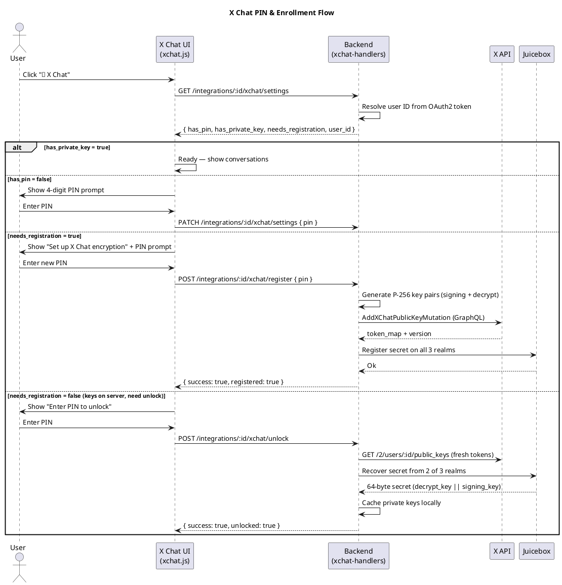
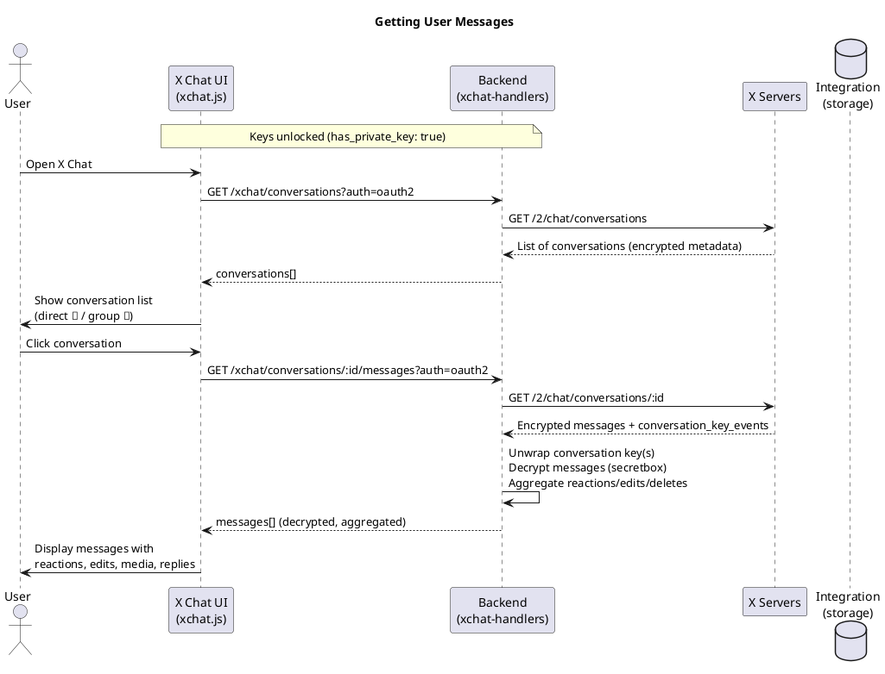
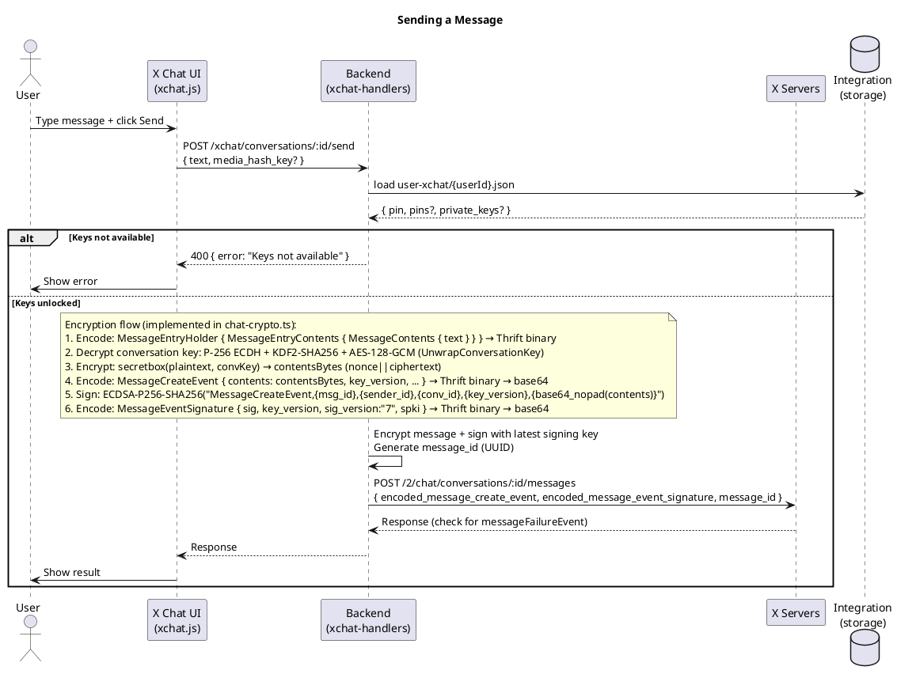
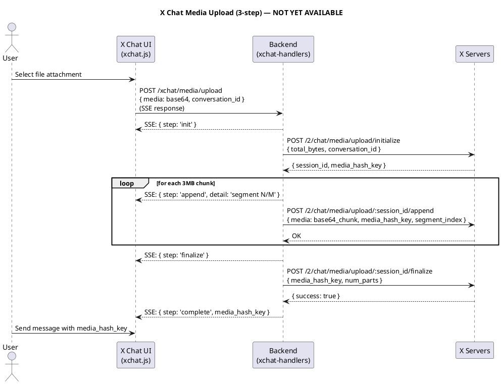
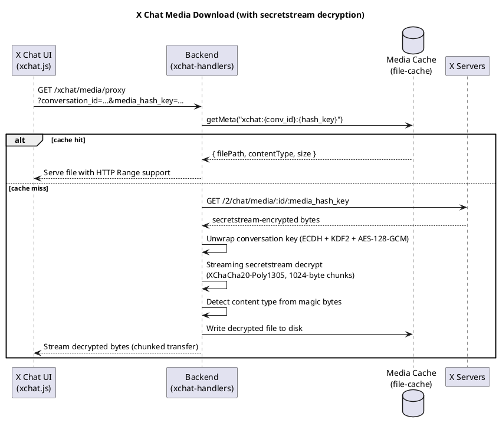
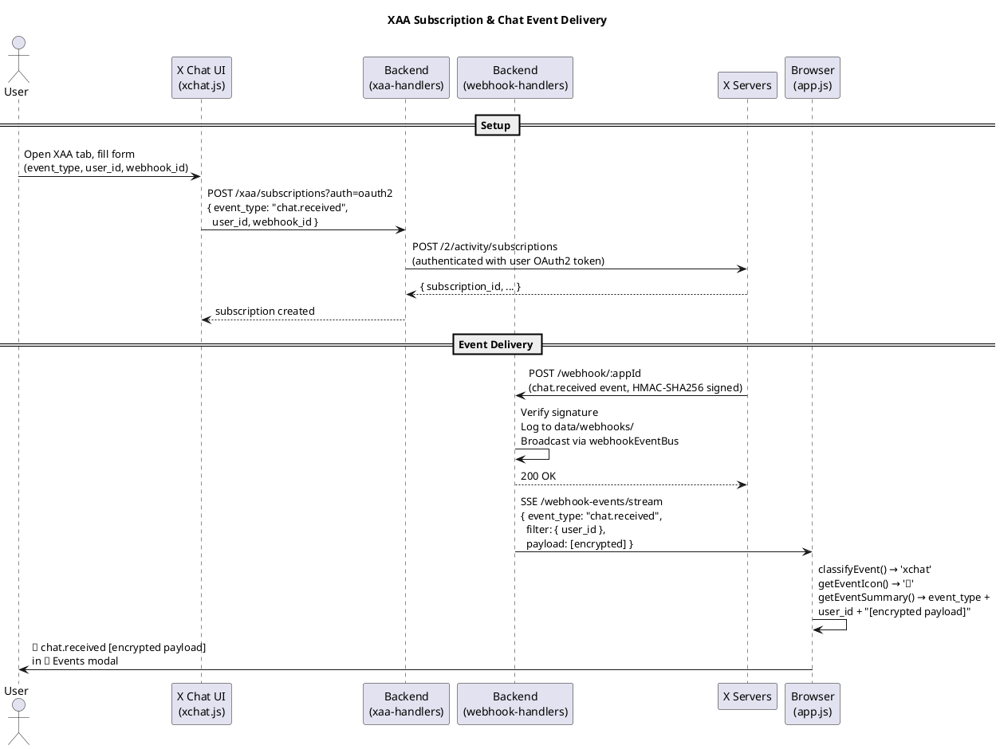

# X Chat Feature — Requirements, Design & Tasks

> Reference: [XChat Migration Guide](XCHAT-MIGRATION-GUIDE.md) | [XChat PDF](../../XChat_Beta_Enterprise_User_Migration_Guide_v1.pdf)

## Requirements

### Functional Requirements

1. **Chat Mode Selection** — When user clicks "💬 Chat", choose between Legacy DM or X Chat.

2. **X Chat: PIN Management** — Each key version has its own 4-digit numeric PIN (set in the X app at the time of key creation). A default PIN can be set as fallback. Per-version PINs take precedence. PINs are used to enroll private keys in Juicebox during registration and retrieve them during recovery. At least one PIN is required before any chat operation.

3. **X Chat: Key Enrollment & New Identity** — During initial setup, the client checks if the user has any registered public keys via `GET /2/users/{id}/public_keys`. If empty, it generates random P-256 key pairs, publishes public keys to X, and enrolls the private keys in Juicebox protected by the user's PIN. If keys already exist, enrollment is skipped unless `force` is set — this creates a **new key version** (new identity) alongside existing ones. The server wraps future conversation keys for the latest version only. All existing key versions can be recovered from Juicebox using their respective PINs.

4. **X Chat: List Conversations** — `GET /2/chat/conversations`

5. **X Chat: Start New Conversation** — Select a follower from the followers list, initialize conversation keys via `POST /2/chat/conversations/{recipientId}/keys` (wraps a new conversation key for both participants), then send the first encrypted message. The server constructs the canonical conversation ID from the two user IDs.

6. **X Chat: View Messages** — `GET /2/chat/conversations/{id}` (paginated, server-side decryption with cached keys, reactions/edits/deletes aggregated)

7. **X Chat: Send Messages** — `POST /2/chat/conversations/{id}/messages`. Full encryption: secretbox + ECDSA signature. Supports text, media attachments, replies, reactions, edits, and deletes.

8. **X Chat: Upload Media** — 3-step: initialize → append (chunked) → finalize → `media_hash_key`. ⚠️ **API returns 503** — not yet deployed by X.

9. **X Chat: Download Media** — `GET /2/chat/media/{id}/{media_hash_key}`. Returns secretstream-encrypted bytes (XChaCha20-Poly1305). Decrypted with conversation key, streamed to client with HTTP Range support for video/audio seeking.

10. **X Chat: Get User Public Keys** — `GET /2/users/{id}/public_keys`

11. **X Chat: Real-time Events (XAA)** — Subscribe to `chat.received` / `chat.sent` via `POST /2/activity/subscriptions` with `webhook_id`. Events arrive as webhook POSTs to the existing receiver, logged and broadcast via the same `webhookEventBus`, displayed in the "📨 Events" modal with a 🔐 icon.

### Non-Functional Requirements

- X Chat requires **OAuth2** only.
- XAA create/list: BearerToken, OAuth2, or OAuth1. XAA delete: BearerToken only.
- PIN is 4 digits. Default PIN stored per user; per-version PINs override it. Private key pairs (versioned) and conversation keys cached per user. Never returned in API responses — only presence reported.
- Legacy DM flow and Account Activity webhooks remain fully functional.

### X Chat Enrollment Flow

`registerKeys` is the central function for setting up X Chat for a user. It is called in the following scenarios:

#### Triggering the Flow (UI)
1.  **Initial Setup:** When a user opens X Chat for the first time and sets their 4-digit PIN. 
    - `savePin()` (in `xchat.js`) saves the PIN to the server.
    - Upon success, `checkPinAndShow()` detects that keys are missing and triggers `renderPinPrompt(true)`.
    - Clicking "Save PIN" in the registration context eventually triggers `registerKeys()`.
2.  **Missing Keys:** If a user has a PIN but no public keys are registered on the X server.
    - `checkPinAndShow()` detects `needs_registration: true`.
    - `renderRegistrationPrompt()` displays a button: "Generate & Register Keys".
    - Clicking this button calls `XChatUI.registerKeys()`.

#### Execution Logic (Backend)
When `POST /integrations/:id/xchat/register` is called:
1.  **Safety Check:** It first calls `GET /2/users/{id}/public_keys` to see if keys already exist.
    - If keys are found and `force` is not set, it skips enrollment and returns success.
    - If `force: true` is passed, it proceeds to generate a new key version (new identity).
2.  **Key Generation:** Generates two random P-256 key pairs (Decrypt and Signing).
3.  **X Registration:** Publishes the public keys to X via `POST /2/users/{id}/public_keys`.
    - Includes the `identity_public_key_signature` (proof of ownership).
    - Server assigns a version (timestamp-based).
4.  **Juicebox Enrollment:** Enrolls the private keys in the Juicebox network, protected by the user's PIN.
5.  **Local Storage:** Caches the new key pair in `private_keys[version]` alongside any existing versions.

### Encryption Stack

Verified against the Go reference implementation at `/Users/dcherkas/projects/opensource/twitter` (mautrix-twitter), specifically `pkg/twittermeow/crypto/` and `pkg/juiceboxgo/`.

| Layer | Detail |
|-------|--------|
| Key types | Two separate **P-256 ECDSA** keys per user: `SigningKey` (sign messages) + `DecryptKey` (unwrap conversation keys). Both stored as base64-encoded 32-byte raw private scalars |
| Key custody | Juicebox — PIN-based threshold secret sharing (OPRF protocol). Full TypeScript port in `xchat/juicebox/` (recovery + registration) |
| Conversation key wrapping | **P-256 ECDH + KDF2-SHA256 + AES-128-GCM**. Blob: `ephPub(65 uncompressed) \| AES-GCM(ct+tag)`. KDF: `SHA256(shared \| counter_BE32 \| ephPub)` → first 16 = AES key, last 16 = IV. Result is a 32-byte secretbox key |
| Message encryption | **XSalsa20-Poly1305 (libsodium secretbox)**. Layout: `nonce(24) \| ciphertext+mac`. Key: decrypted 32-byte conversation key |
| Plaintext wire format | `MessageEntryHolder { contents: MessageEntryContents { message: MessageContents { text } } }` → Thrift binary → secretbox encrypted → `MessageCreateEvent.contents` (bytes field, thrift id 100) → Thrift binary → base64 → `encoded_message_create_event` |
| Message signing | **ECDSA P-256 SHA-256**. Preimage: `"MessageCreateEvent,{msg_id},{sender_id},{conv_id},{key_version},{base64_nopad(contents_bytes)}"`. Signature: raw `r(32)\|\|s(32)` → base64 with padding. `MessageEventSignature` thrift → base64 → `encoded_message_event_signature`. Signature version: `"7"` |
| Conversation token | Server-provided opaque token per conversation, extracted from incoming `MessageEvent.conversation_token`. Required for sending. Stored in `ConversationKeyStorage` |
| Media encryption | **libsodium secretstream (XChaCha20-Poly1305)**. Header (24 bytes) + chunks of 1041 bytes (1024 plaintext + 17 overhead). Key: same 32-byte conversation key used for messages |

**Previously incorrect assumptions** (from xchat-bot-python/Go API surface only):
- ~~X25519 + Ed25519~~ → actually P-256 ECDSA (two separate keys)
- ~~AES-256-GCM message encryption~~ → actually XSalsa20-Poly1305 secretbox
- ~~X25519 + HKDF + AES-256-GCM key wrapping~~ → actually P-256 ECDH + KDF2-SHA256 + AES-128-GCM
- ~~Flat MessageCreateEvent thrift~~ → actually nested MessageEntryHolder wrapper

### Key Storage Model

```
data/user-xchat/{userId}.json
  id: string                              // user ID
  pin?: string                            // default 4-digit PIN (fallback when per-version PIN not set)
  pins?: Record<string, string>           // per-version PINs: version → PIN (takes precedence over default)
  private_keys?: Record<string, KeyPair>  // version → { signingKeyB64, decryptKeyB64 }

data/user-public-keys/{userId}.json
  public_key: string             // P-256 public key (SPKI base64) — for encrypting conv keys to this user
  signing_public_key: string     // P-256 signing public key (SPKI base64) — for verifying signatures
  version: string                // key version
  juicebox_config: object        // Juicebox realm config for PIN-based key recovery

data/conversation-keys/{conversationId}.json
  encrypted_conversation_key: string  // wrapped 32-byte secretbox key (from KeyChange event)
  key_version: string
  conversation_token?: string         // server-provided token required for sending
```

No xchat data is stored on the integration. All xchat data is user-scoped or conversation-scoped.

### Key Versioning Behavior

- Users can have **multiple key versions** (each with its own signing + decrypt key pair).
- The server wraps `conversation_key_change_event` for the **latest** encryption public key only. Old key versions cannot unwrap webhook conversation keys.
- Each participant entry in a conversation includes `public_key_version` — this tells exactly which private key to use for unwrapping (no brute-force needed).
- The server **replaces** `signing_public_key` in the signature thrift based on the declared `public_key_version` — it does NOT pass through what the sender originally embedded.
- The server does NOT validate signatures at send time (all key combinations accepted with 200 OK). Validation happens on the receiving end.
- Mismatched declarations (signing with key A but declaring version B) cause INVALID signatures on the receiving end.

### Similarities: Legacy DM vs X Chat

| Aspect | Legacy DM | X Chat |
|--------|-----------|--------|
| Auth | OAuth1 or OAuth2 | OAuth2 only |
| List conversations | followers list | `GET /2/chat/conversations` |
| Get messages | `GET /2/dm_events` by participant | `GET /2/chat/conversations/{id}` (encrypted) |
| Send message | `POST /2/dm_conversations/.../messages` | `POST /2/chat/conversations/{id}/messages` (encrypted) |
| Media upload | INIT/APPEND/FINALIZE → `media_id` | initialize/append/finalize → `media_hash_key` |
| Media download | TON URL via `dmConversationsMediaDownload` | `GET /2/chat/media/{id}/{media_hash_key}` |
| Real-time events | Account Activity API (webhooks) | X Activity API — XAA (webhooks or stream) |

### Architecture

```
oauth-demo/
├── handlers/
│   ├── handler-utils.ts        resolveAuth(), sseResponse(), shared mediaCache  [DONE]
│   ├── dm-handlers.ts          legacy DM — refactored to use handler-utils      [DONE]
│   ├── media-handlers.ts       legacy media — refactored to use handler-utils   [DONE]
│   ├── xchat-handlers.ts       X Chat: conversations, messages, send, react, edit, delete, media, settings, unlock, register, change-pin [DONE]
│   ├── xaa-handlers.ts         XAA subscription management                      [DONE]
│   ├── webhook-handlers.ts     Webhook ingestion + xchat auto-decrypt           [DONE]
│   ├── webhook-mgmt-handlers.ts  Account Activity webhook CRUD                  [DONE]
│   ├── integration-handlers.ts Integration CRUD                                 [DONE]
│   └── oauth-handlers.ts       OAuth flow handlers                              [DONE]
├── xchat/
│   ├── chat-crypto.ts          encrypt/decrypt, key wrap, ECDSA sign/verify     [DONE]
│   ├── chat-thrift.ts          Thrift encode/decode for message types           [DONE]
│   ├── thrift-codec.ts         Generic Thrift binary protocol codec             [DONE]
│   ├── thrift-models.ts        Schema definitions from Go structs               [DONE]
│   ├── xchat-utils.ts          Conversation ID normalization                   [DONE]
│   ├── secretstream.ts         libsodium secretstream for media                 [DONE]
│   └── juicebox/               OPRF threshold recovery + registration (9 files) [DONE]
├── public/
│   ├── app.js                  chat mode selection, xchat event classification  [DONE]
│   ├── xchat.js                X Chat UI: key mgmt, conversations, messages     [DONE]
│   └── style.css               X Chat styles                                    [DONE]
├── oauth-demo.ts               all routes registered                            [DONE]
├── storage.ts                  typed storage classes                            [DONE]
└── types.ts                    Integration type definitions                     [DONE]
```

### New Backend Routes

| Method | Route | Handler | Description |
|--------|-------|---------|-------------|
| GET | `/integrations/:id/xchat/settings` | `getXChatSettings` | Get xchat config (presence only, no secrets) |
| PATCH | `/integrations/:id/xchat/settings` | `updateXChatSettings` | Save PIN / conversation keys |
| POST | `/integrations/:id/xchat/unlock` | `unlockKeys` | Recover all key versions from Juicebox |
| POST | `/integrations/:id/xchat/unlock/:version` | `unlockKeyVersion` | Recover a single key version with specific PIN |
| POST | `/integrations/:id/xchat/register` | `registerKeys` | Generate new key pair, publish to X, enroll in Juicebox |
| POST | `/integrations/:id/xchat/change-pin` | `changePin` | Change PIN for latest key (re-register in Juicebox) |
| POST | `/integrations/:id/xchat/change-pin/:version` | `changePinForVersion` | Change PIN for a specific key version |
| GET | `/integrations/:id/xchat/conversations` | `getXChatConversations` | List chat conversations |
| GET | `/integrations/:id/xchat/conversations/:conversationId/messages` | `getXChatMessages` | Get messages (decrypted) |
| POST | `/integrations/:id/xchat/conversations/:conversationId/send` | `sendXChatMessage` | Send encrypted message |
| POST | `/integrations/:id/xchat/conversations/:conversationId/react` | `reactToMessage` | Add/remove emoji reaction |
| POST | `/integrations/:id/xchat/conversations/:conversationId/edit` | `editMessage` | Edit a sent message |
| POST | `/integrations/:id/xchat/conversations/:conversationId/delete` | `deleteMessage` | Delete message (for self or all) |
| POST | `/integrations/:id/xchat/conversations/:conversationId/typing` | `sendTypingIndicator` | Send typing indicator |
| POST | `/integrations/:id/xchat/media/upload` | `uploadXChatMedia` | 3-step upload (SSE progress, secretstream encrypted) |
| GET | `/integrations/:id/xchat/media/proxy` | `proxyXChatMedia` | Download/proxy xchat media (streaming decrypt) |
| GET | `/integrations/:id/xchat/users/:userId/public-keys` | `getUserPublicKeys` | Get user public keys |
| GET | `/integrations/:id/xaa/subscriptions` | `getXAASubscriptions` | List XAA subscriptions |
| POST | `/integrations/:id/xaa/subscriptions` | `createXAASubscription` | Create chat event subscription |
| PUT | `/integrations/:id/xaa/subscriptions/:subscriptionId` | `updateXAASubscription` | Update subscription |
| DELETE | `/integrations/:id/xaa/subscriptions/:subscriptionId` | `deleteXAASubscription` | Delete subscription |

---

## Implemented Flows

### PIN Setup Flow



#### Enrollment Detection Logic

The `getXChatSettings` handler determines the user's state:

```typescript
// 1. Check local cache for any unlocked key versions
const xchat = await userXChatStorage.load(userId);
const hasKeys = xchat?.private_keys && Object.keys(xchat.private_keys).length > 0;
if (hasKeys) return { has_private_key: true, needs_registration: false };

// 2. Check server for published keys
const pkResponse = await client.users.getUsersPublicKey(userId);
const hasPublicKeys = !!pkResponse?.data?.public_key;

return {
  has_private_key: false,
  has_pin: !!xchat?.pin,
  needs_registration: !hasPublicKeys,
};
```

### Getting User Messages Flow



### Sending a Message Flow



The backend gates on key availability — if keys are not unlocked, the request is rejected before reaching the API. The `ensureKeys()` function automatically recovers keys from Juicebox if a PIN is available.

### Media Upload Flow

> ⚠️ **Status**: API returns 503 — endpoints not yet deployed by X. Code is implemented but untestable.



### Media Download / Proxy Flow



### XAA Subscription + Webhook Event Flow



---

## Task Status

| Task | Description | Status |
|------|-------------|--------|
| 1 | Extract shared handler utilities (`handler-utils.ts`) | ✅ Done |
| 2 | X Chat backend handlers (`xchat-handlers.ts`) | ✅ Done |
| 3 | Register new routes in `oauth-demo.ts` | ✅ Done |
| 4 | Frontend chat mode selection (`app.js`) | ✅ Done |
| 5 | X Chat UI (`xchat.js`, `index.html`, `style.css`) | ✅ Done |
| 6 | Media attachment flow (upload + download + secretstream encrypt/decrypt) | ✅ Done |
| 7 | XAA backend handlers (`xaa-handlers.ts`) | ✅ Done |
| 8 | XAA frontend (subscription management + event display) | ✅ Done |
| 9 | PIN management + key unlock flow (per-version PINs) | ✅ Done |
| 10 | Separate user/conversation key storage from integration | ✅ Done |
| 11 | Correct encryption stack (P-256, secretbox, KDF2) | ✅ Done |
| 12 | Juicebox key recovery (PIN → private keys, multi-version) | ✅ Done |
| 13 | Juicebox key registration (generate + publish + enroll) | ✅ Done |
| 14 | Message history from API (`GET /events`) with decryption | ✅ Done |
| 15 | Reactions (send + receive + aggregate) | ✅ Done |
| 16 | Edit messages (send + receive + aggregate) | ✅ Done |
| 17 | Delete messages (for self / for all) | ❌ Blocked — REST returns failure_type 14; GraphQL requires web session (no OAuth2) |
| 18 | User lookup + avatars in UI | ✅ Done |
| 19 | Signature version "7" | ✅ Done |
| 20 | Enrollment detection + registration UI flow | ✅ Done |
| 21 | Multi-key version support (versioned storage, per-version unlock/PIN) | ✅ Done |
| 22 | Message signature verification on receive | ✅ Done |
| 23 | Disappearing messages (TTL) | ✅ Done |
| 24 | Reply-to and forwarded message display | ✅ Done |
| 25 | Media secretstream encryption/decryption (upload + streaming download) | ✅ Done |
| — | Typing indicators | ✅ Done |
| — | Media download (secretstream decrypt + streaming + Range support) | ✅ Done |
| — | New conversation key exchange (`POST /conversations/{id}/keys`) | ✅ Done |
| — | Media upload (API returns 503 "NOT YET IN PROD") | ❌ Blocked — X has not deployed the endpoint |

---

## Juicebox TypeScript Port

### Crypto Primitives Required

| Primitive | Used In | Purpose | TypeScript Library |
|-----------|---------|---------|-------------------|
| **Ristretto255** (scalar/point arithmetic) | OPRF, Shamir secret sharing | Blinding, evaluation, Lagrange interpolation | `@noble/curves` (ristretto255 via ed25519 module) |
| **Argon2id** | PIN hashing | Derive `access_key` (32B) + `encryption_key_seed` (32B) from PIN | `hash-wasm` or `@noble/hashes/argon2` |
| **SHA-512** | OPRF finalization, unlock key derivation | Hash OPRF output to 64 bytes | Node.js `crypto` built-in |
| **Blake2s-256** | Noise protocol, encryption key derivation | MAC for key derivation, Noise hash function | `@noble/hashes` (blake2s) |
| **Blake2s-128** (keyed MAC) | Unlock key tag, secret commitment | Realm-specific tags and commitments | `@noble/hashes` (blake2s) |
| **ChaCha20-Poly1305** | Noise transport, secret encryption | Noise cipher, decrypt recovered secret | `@noble/ciphers` (chacha20poly1305) |
| **X25519** | Noise NK handshake | Ephemeral DH with realm static key | `@noble/curves` (x25519) |
| **Ed25519** | OPRF signature verification | Verify realm's OPRF public key signature | `@noble/curves` (ed25519) |
| **HKDF-Blake2s** | Noise key derivation | `mix_key` and `split` operations | `@noble/hashes` (hkdf + blake2s) |
| **CBOR** | Realm request/response serialization | Encode/decode Juicebox protocol messages | `cbor-x` or `cborg` |

### Protocol Overview

The Juicebox recovery protocol has 3 phases, each involving parallel requests to multiple realms:

```
Phase 1: Query version
  → Each realm returns its stored RegistrationVersion
  → Client picks version with threshold agreement

Phase 2: OPRF evaluation
  → Client: hash PIN with Argon2id → access_key
  → Client: blind access_key with random scalar → blinded_input
  → Each realm: evaluate OPRF on blinded_input → blinded_result_share + DLEQ proof
  → Client: verify DLEQ proofs, combine shares via Lagrange interpolation
  → Client: finalize OPRF → derive unlock_key, verify commitment

Phase 3: Retrieve encrypted secret
  → Client: derive unlock_key_tag per realm
  → Each realm: verify tag, return encrypted_secret + encryption_key_scalar_share
  → Client: combine scalar shares via Lagrange interpolation
  → Client: derive encryption_key from seed + combined scalar
  → Client: decrypt secret with ChaCha20-Poly1305
```

The recovered secret is the raw P-256 private key material (signing + decrypt keys).

### Implementation Plan

All tasks completed. 9 files in `juicebox/` directory:

| # | File | Purpose |
|---|------|---------|
| 1 | `pin.ts` | Argon2id PIN hashing with salt construction |
| 2 | `oprf.ts` | OPRF start (blind), finalize (unblind), DLEQ verify, key generation |
| 3 | `shamir.ts` | Lagrange interpolation for scalars and points, secret splitting |
| 4 | `crypto.ts` | DeriveUnlockKey, DeriveEncryptionKey, DecryptSecret, EncryptSecret, tags/commitments |
| 5 | `noise.ts` | Noise NK handshake, transport encrypt/decrypt |
| 6 | `realm.ts` | HTTP communication (software + hardware realms), CBOR serialization |
| 7 | `config.ts` | Parse and validate Juicebox config from public_keys response |
| 8 | `client.ts` | Orchestrate 3-phase recovery + registration with parallel realm requests |
| 9 | `index.ts` | Re-exports |

### Dependencies to Install

```bash
cd oauth-demo
npm install @noble/curves @noble/hashes @noble/ciphers hash-wasm cbor-x
```

(`@noble/curves` and `@noble/hashes` may already be installed from the previous chat-crypto.ts)


## Juicebox Key Registration (Not Yet Implemented)

### Overview

Key registration is the process of generating new P-256 key pairs and storing the private key material in Juicebox realms, protected by the user's PIN. This is required for:
- Setting up encryption for a new X Chat user
- Changing/resetting a PIN
- Rotating keys

Currently only key **recovery** is implemented. Registration requires the inverse flow.

### Registration Flow (from HAR capture)

```
1. Client generates P-256 key pairs (signing + decrypt)
2. Client calls AddXChatPublicKeyMutation (GraphQL)
3. Server returns Juicebox token_map with fresh auth tokens
4. Client registers secret with all 3 Juicebox realms
5. Keys are now recoverable with PIN
```

### Step 1: Generate Key Pairs

```typescript
// Generate two P-256 ECDSA key pairs
const decryptKey = crypto.createECDH('prime256v1').generateKeys();
const signingKey = crypto.createECDH('prime256v1').generateKeys();

// The 64-byte secret to store in Juicebox:
// bytes[0:32] = decrypt key private scalar
// bytes[32:64] = signing key private scalar
const secret = Buffer.concat([decryptKey.getPrivateKey(), signingKey.getPrivateKey()]);
```

### Step 2: AddXChatPublicKeyMutation

```graphql
mutation AddXChatPublicKeyMutation($variables: String!) {
  user_add_public_key(variables: $variables) {
    __typename
    token_map { ... }
    version
  }
}
```

Variables (JSON-encoded string):
```json
{
  "version": "<timestamp_ms>",
  "generate_version": true,
  "public_key": {
    "public_key": "<SPKI base64 of decrypt key>",
    "signing_public_key": "<SPKI base64 of signing key>",
    "identity_public_key_signature": "<base64 signature>",
    "registration_method": "CustomPin"
  }
}
```

**Signature Preimage:**
`"AddXChatPublicKeyMutation,{decrypt_public_key_spki},{signing_public_key_spki}"`
- **Algorithm:** ECDSA P-256 with SHA-256.
- **Preimage Components:**
    - `{decrypt_public_key_spki}`: The base64-encoded SPKI of the decryption public key.
    - `{signing_public_key_spki}`: The base64-encoded SPKI of the signing public key.
- **Signature Format:** Raw `r(32) || s(32)` (64 bytes), base64 encoded with padding.
- **Key Used:** Signed using the user's **Signing Key**.
- **Requirement:** The `public_key` field in the JSON matches `decrypt_public_key_spki`.

Response includes `token_map` with auth tokens for all 3 realms (same format as recovery).

### Step 3: Register with Juicebox Realms

All 3 realms must be registered (`register_threshold: 3`).

#### Software Realm (realm-b.x.com)

Direct CBOR over HTTP (no Noise handshake):

**Phase 1:**
- Request: CBOR string `"Register1"`
- Response: `{"Register1": "Ok"}`

**Phase 2:**
- Request: CBOR `"Register2"` with struct:
  ```
  {
    version: <realm_state_version>,
    oprf_private_key: <32 bytes>,
    oprf_signed_public_key: {
      public_key: <32 bytes>,
      verifying_key: <32 bytes>
    },
    unlock_key_commitment: <32 bytes>,
    unlock_key_tag: <16 bytes>,
    encryption_key_scalar_share: <32 bytes>,
    encrypted_secret: <encrypted>,
    encrypted_secret_commitment: <32 bytes>,
    num_guesses: <max_guess_count>,
    policy: { num_guesses: <max_guess_count> }
  }
  ```
- Response: `{"Register2": "Ok"}`

#### Hardware Realms (realm-east1.x.com, realm-west1.x.com)

Noise NK handshake + Transport (same as recovery):

**Phase 1:** Noise NK handshake with `Register1` piggybacked
**Phase 2:** Transport-encrypted `Register2` payload (same struct as software realm)

### Crypto Operations for Registration

1. **Argon2id** the PIN (same as recovery: `Standard2019` mode)
2. **OPRF key generation**: Generate random Ristretto255 scalar as `oprf_private_key`, derive `public_key` = scalar × basepoint
3. **Shamir secret sharing**: Split the 64-byte secret into 3 shares (one per realm)
4. **Encryption**: For each realm, derive `unlock_key` from OPRF output, encrypt the secret share
5. **Commitments**: Compute commitment hashes for verification

### Implementation Status

All registration steps are implemented in `handlers/xchat-handlers.ts` (`registerKeys` handler) and `juicebox/client.ts` (`register` function).


## File/Directory Layout

All X Chat code lives in `oauth-demo/` (not a dedicated `xchat/` subdirectory):

| File | Purpose |
|------|---------|
| `xchat/chat-crypto.ts` | Encryption, key wrapping, secretbox, ECDSA signing, `encryptMessage()`, `encryptReaction()`, `encryptEdit()`, `verifyMessageSignature()` |
| `xchat/chat-thrift.ts` | Thrift encode/decode wrappers using generic codec + schemas |
| `xchat/thrift-codec.ts` | Generic Thrift binary protocol encoder/decoder |
| `xchat/thrift-models.ts` | Auto-generated schema definitions from Go structs |
| `xchat/xchat-utils.ts` | Conversation ID normalization (`toCanonicalConvId`, `toApiConvId`, `extractRecipientId`) |
| `xchat/secretstream.ts` | libsodium secretstream encrypt/decrypt for media (XChaCha20-Poly1305) |
| `xchat/juicebox/` | Full Juicebox OPRF threshold recovery + registration port (9 files) |
| `handlers/xchat-handlers.ts` | All X Chat REST handlers (conversations, messages, send, react, edit, delete, settings, unlock, register, change-pin, typing, media) |
| `handlers/webhook-handlers.ts` | Webhook ingestion + automatic xchat decryption (multi-key) |
| `handlers/xaa-handlers.ts` | XAA subscription CRUD |
| `handlers/webhook-mgmt-handlers.ts` | Account Activity webhook management |
| `public/xchat.js` | Frontend X Chat modal UI (key management tab, conversations, messages) |
| `public/app.js` | Chat mode selection, xchat event classification |
| `data/user-xchat/` | Per-user PIN(s) + versioned private keys |
| `data/user-public-keys/` | Cached public keys + juicebox config |
| `data/conversation-keys/` | Cached wrapped conversation keys + conversation tokens |
| `xchat/XCHAT-NOTES.md` | Pitfalls, gotchas, undocumented behaviors |
| `xchat/XCHAT-FEATURE.md` | This document — requirements, design, tasks |
